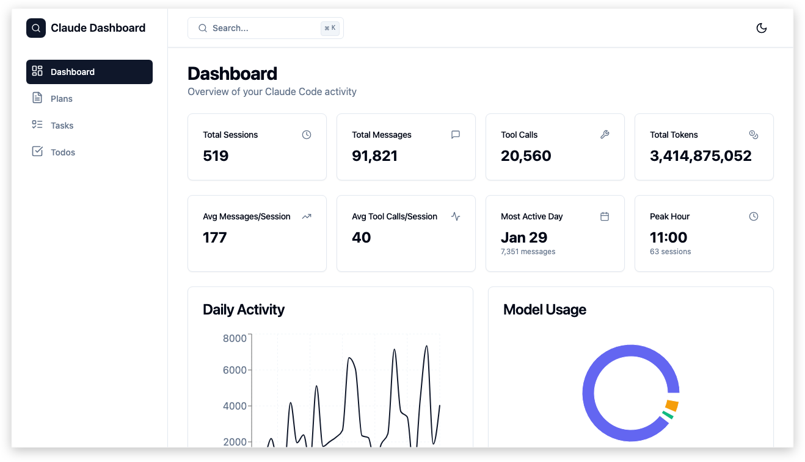

# Claude Dashboard

A web application for tracking and visualizing local Claude Code activity. Monitor sessions, browse implementation plans, tasks and todos, and view usage statistics.



## Features

### Analytics & Insights
- **8 Key Metrics** - Total sessions, messages, tool calls, tokens, averages per session, most active day, and peak hour
- **Daily Activity Chart** - 30-day trend of messages and tool calls with interactive line graph
- **Model Usage Chart** - Token distribution across Claude models (Opus, Sonnet, Haiku)
- **Hourly Activity Chart** - Session distribution by hour to identify usage patterns

### Plans Management
- **Browse & Search** - Filter through all implementation plans with instant search
- **Sort Options** - Order by newest or oldest creation date
- **Markdown Rendering** - Full markdown support with syntax highlighting
- **Metadata Display** - File size and creation date for each plan

### Tasks Tracking
- **Status Filtering** - Filter by All, Pending, In Progress, or Completed
- **Session Grouping** - Tasks organized by their originating session with project names
- **Dependency Visualization** - See which tasks block or are blocked by others
- **Status Badges** - Color-coded status indicators (green/yellow/gray)

### Todos Management
- **Progress Tracking** - Visual progress bars showing completion status per session
- **Session Cards** - Todo items grouped by session with completion counts (e.g., 4/5)
- **Status Indicators** - Checkmarks for completed items, circles for pending

### Global Features
- **Global Search** - Quick search across all content with `Cmd+K`
- **Dark/Light Mode** - Theme switching with system preference detection
- **Real-Time Updates** - Live synchronization via Server-Sent Events when data changes
- **Responsive Design** - Optimized layout for desktop viewing

## Tech Stack

**Frontend:**
- React 18 + TypeScript
- Vite (build tool)
- TanStack React Query (data fetching)
- Tailwind CSS + Radix UI (styling)
- Recharts (data visualization)

**Backend:**
- Express.js + TypeScript
- Chokidar (file watching)
- Server-Sent Events (real-time updates)

## Prerequisites

- Node.js 18+ (18.20.4 or later recommended)
- npm 9+

## Installation

```bash
# Clone the repository
git clone git@github.com:ducrot/claude-dashboard.git
cd claude-dashboard

# Install all dependencies (root, client, and server)
npm install
```

## Development

```bash
# Run both client and server concurrently
npm run dev

# Or run them separately:
npm run dev:client   # Frontend at http://localhost:5174
npm run dev:server   # Backend at http://localhost:3001
```

## Production Build

```bash
# Build both client and server
npm run build

# Start production server
npm start
```

## Project Structure

```
claude-dashboard/
├── client/                     # React frontend
│   ├── src/
│   │   ├── pages/             # Page components (Dashboard, Plans, Tasks, Todos)
│   │   ├── components/
│   │   │   ├── ui/            # Reusable UI components
│   │   │   ├── layout/        # Layout components (Sidebar, Header)
│   │   │   ├── dashboard/     # Dashboard-specific components
│   │   │   ├── plans/         # Plan display components
│   │   │   ├── tasks/         # Task components
│   │   │   └── todos/         # Todo components
│   │   ├── hooks/             # Custom React hooks (useTheme, useSSE)
│   │   ├── lib/               # API client and utilities
│   │   └── App.tsx            # Main app with routing
│   └── vite.config.ts         # Vite configuration
│
├── server/                     # Express backend
│   ├── src/
│   │   ├── routes/            # API route handlers
│   │   ├── services/          # Business logic and data operations
│   │   ├── config/            # Path configuration
│   │   └── index.ts           # Express app setup
│   └── tsconfig.json          # Server TypeScript config
│
└── package.json               # Root monorepo configuration
```

## Configuration

### Data Directory

The application reads from the Claude Code local directory:

```
~/.claude/
├── plans/              # Markdown plan files
├── tasks/              # Task JSON files
├── todos/              # Todo JSON files
├── projects/           # Session index files
└── stats-cache.json    # Cached statistics
```

### Environment Variables

| Variable | Default | Description |
|----------|---------|-------------|
| `PORT`   | `3001`  | Express server port |

## API Endpoints

| Method | Endpoint | Description |
|--------|----------|-------------|
| GET | `/api/plans` | List all plans |
| GET | `/api/plans/:filename` | Get specific plan |
| GET | `/api/tasks` | List all tasks |
| GET | `/api/todos` | List all todos |
| GET | `/api/stats` | Get statistics with chart data |
| GET | `/api/stats/summary` | Get summary statistics |
| GET | `/api/sessions` | List all sessions |
| GET | `/api/search?q=query` | Search across all content |
| GET | `/api/events` | SSE endpoint for real-time updates |
| GET | `/api/health` | Health check |

## Development Notes

### Path Aliases

- Frontend uses `@/` alias for `./src/` imports
- Example: `import { Button } from '@/components/ui/button'`

### Real-Time Architecture

1. Chokidar watches the `~/.claude` directory for file changes
2. Changes are broadcast via EventEmitter
3. Server-Sent Events stream updates to connected clients
4. React Query invalidates and refetches affected data

### Code Style

- TypeScript strict mode enabled
- ES modules throughout
- Radix UI primitives with Tailwind CSS styling

## Scripts Reference

| Script | Description |
|--------|-------------|
| `npm run dev` | Start both client and server in development mode |
| `npm run dev:client` | Start only the frontend dev server |
| `npm run dev:server` | Start only the backend dev server |
| `npm run build` | Build both client and server for production |
| `npm start` | Start the production server |

## Contributing

1. Fork the repository
2. Create a feature branch (`git checkout -b feature/amazing-feature`)
3. Commit your changes (`git commit -m 'Add amazing feature'`)
4. Push to the branch (`git push origin feature/amazing-feature`)
5. Open a Pull Request

## License

[MIT](LICENSE)
